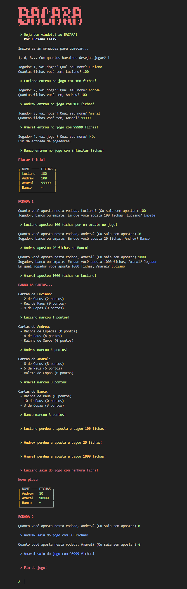

[Andrew Kurauchi, Phd](https://github.com/toshikurauchi). Design de Software. [Insper](https://github.com/Insper), 2020.

# Bacara Game




## Getting Started

1. Clone:
    ```bash
    $ git clone https://github.com/FelixLuciano/bacara-game.git
    ```
2. Enter the folder:
    ```bash
    $ cd Bacara-Game
    ```
3. Then run the game:
    ```bash
    $ python src\index.py
    ```
4. **Have fun!**

## License
This game is [MIT Licensed](LICENSE)!
